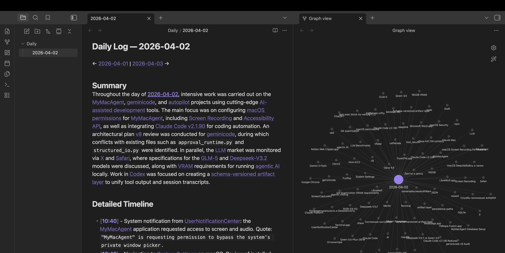
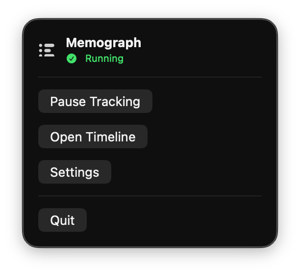
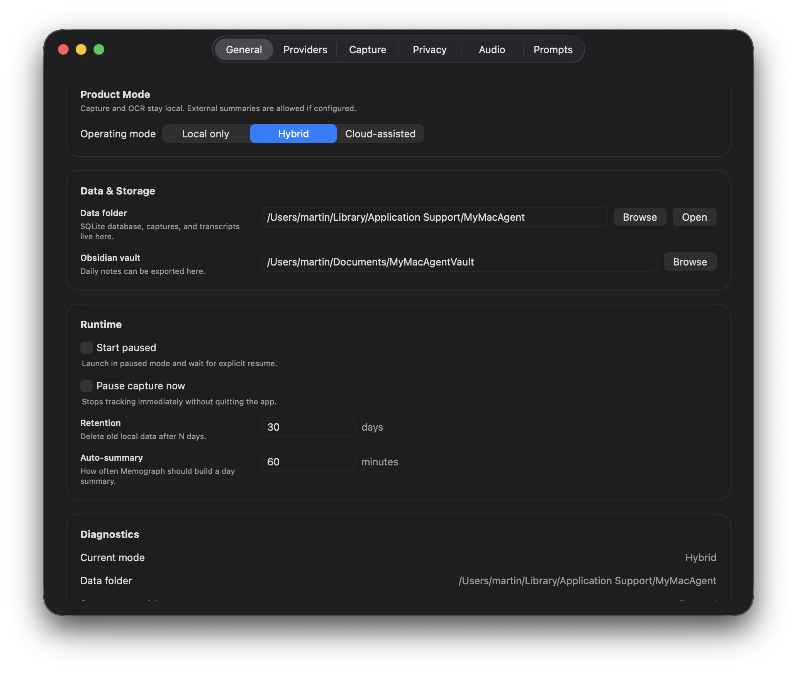
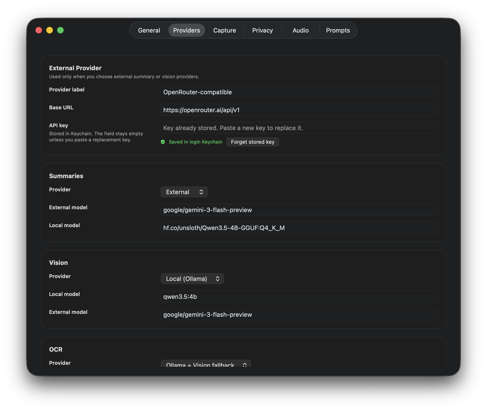
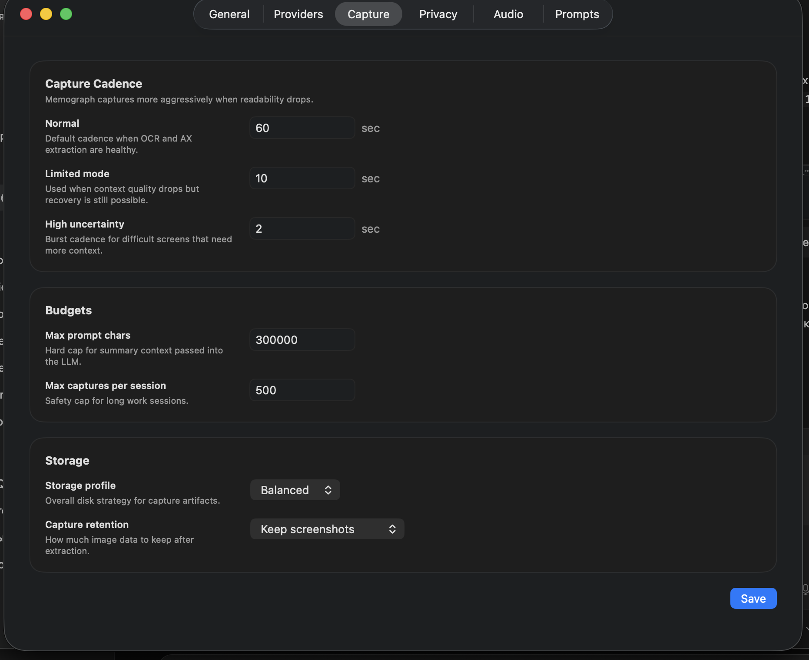
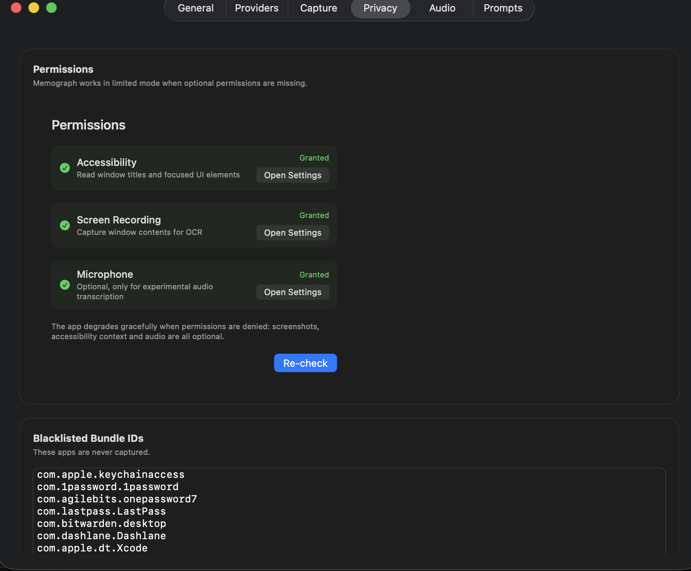
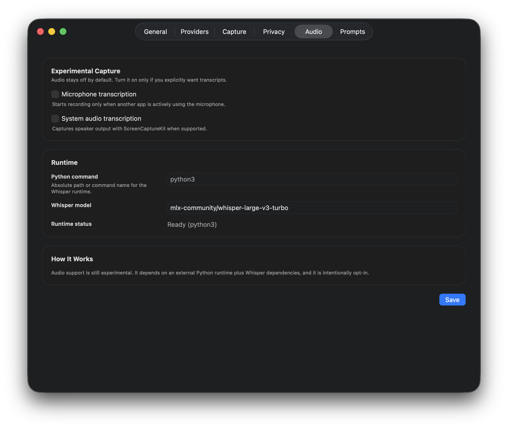
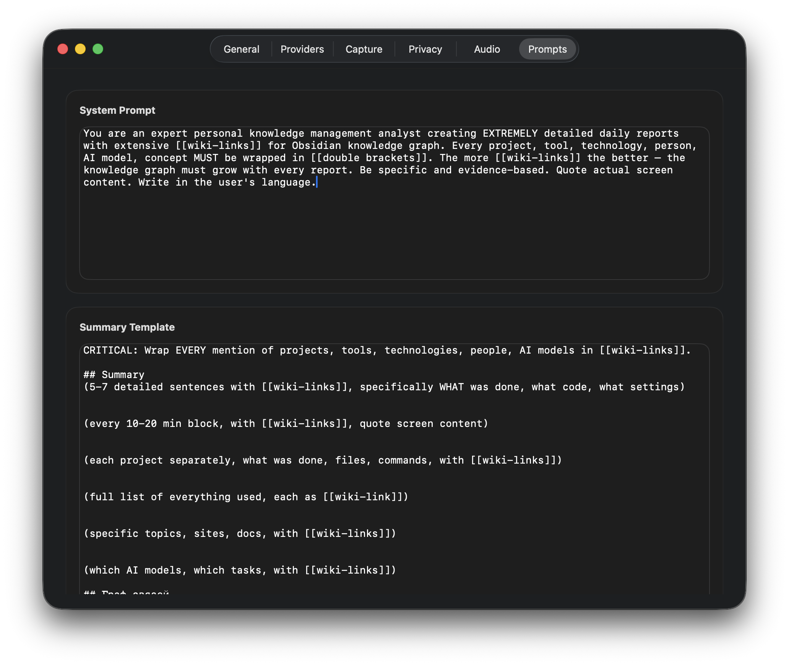
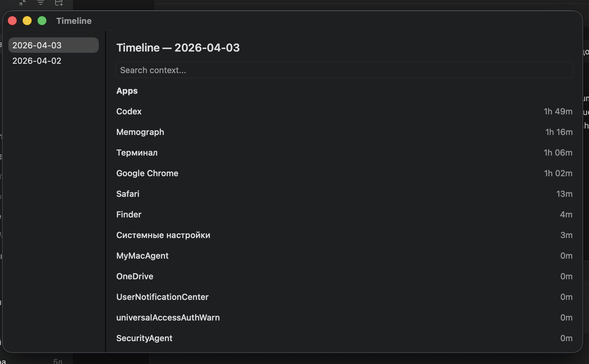

<p align="center">
  
</p>

<h1 align="center">Memograph</h1>

<p align="center">
  <strong>Your Mac remembers everything. You don't have to.</strong>
</p>

<p align="center">
  Memograph runs silently in your menu bar, captures what you do throughout the day,<br/>
  and builds a searchable knowledge graph in Obsidian &mdash; entirely on your Mac.
</p>

<p align="center">
  <a href="#install"></a>&nbsp;
  <a href="#install"></a>&nbsp;
  <a href="#privacy"></a>&nbsp;
  <a href="LICENSE"></a>
</p>

<br/>

<p align="center">
  
</p>

<p align="center"><em>A real daily log with 150+ [[wiki-links]], rendered in Obsidian alongside the auto-generated knowledge graph.</em></p>

---

## The Problem

You spend 8+ hours a day on your Mac. By evening, you can barely recall what you worked on, which tabs you had open, or what that terminal command was. Traditional note-taking requires discipline. Screen recorders generate unwatchable video. Cloud-based "rewind" tools upload your screen to someone else's server.

## The Solution

Memograph captures context automatically &mdash; apps, windows, screenshots, text, audio &mdash; and distills it into a structured daily note with `[[wiki-links]]` that grows your Obsidian knowledge graph over time. No cloud required. No subscription. No data leaves your Mac unless you explicitly choose a cloud summarizer.

---

## Why Memograph

<table>
<tr>
<td width="50%">

**Automatic context capture**<br/>
Tracks apps, windows, screenshots, OCR text, and accessibility context without any manual input.

**AI-powered daily summaries**<br/>
Generates structured daily notes with `[[wiki-links]]` using local or cloud LLMs. Your Obsidian graph grows automatically.

**Adaptive capture intelligence**<br/>
Captures more when screen content changes rapidly, less when you're idle. Saves storage and CPU.

</td>
<td width="50%">

**Privacy-first architecture**<br/>
Screenshots analyzed locally via Ollama. Only text summaries go to cloud (if you opt in). App blacklists, metadata-only mode, pause anytime.

**Full settings control**<br/>
6 settings tabs: General, Providers, Capture, Privacy, Audio, Prompts. Every behavior is configurable.

**Obsidian-native export**<br/>
Daily notes with day navigation, timeline sections, `[[wiki-links]]` for every tool, person, project, and concept mentioned.

</td>
</tr>
</table>

---

## Memograph vs Alternatives

| | **Memograph** | **ScreenPipe** | **Rewind** | **Manual notes** |
|---|:---:|:---:|:---:|:---:|
| **Price** | **Free & open source** | $99/mo | $20/mo | Free |
| **Privacy** | Local-first, no cloud required | Cloud components | Cloud-dependent | Local |
| **Platform** | Native Swift/SwiftUI | Electron + Rust | Native (closed) | Any |
| **Obsidian export** | Built-in with `[[wiki-links]]` | Plugin required | No | Manual |
| **Knowledge graph** | Auto-generated | No | No | Manual |
| **AI summaries** | Local or cloud, your choice | Cloud only | Cloud only | N/A |
| **Screenshot analysis** | Local Ollama or cloud | Cloud | Cloud | N/A |
| **Audio transcription** | Local Whisper | Cloud | Cloud | N/A |
| **App blacklist** | Per-app, per-window pattern | Limited | No | N/A |
| **Open source** | Apache 2.0 | Partial | No | N/A |
| **Resource usage** | ~50 MB RAM, adaptive capture | Heavy | Heavy | Zero |

---

<h2 id="install">Install</h2>

### Homebrew (recommended)

```bash
brew tap MartinCampbell1/memograph
brew install --cask memograph
```

### One command

```bash
curl -fsSL https://raw.githubusercontent.com/MartinCampbell1/Memograph/master/scripts/install.sh | bash
```

### Build from source

```bash
git clone https://github.com/MartinCampbell1/Memograph.git
cd Memograph
make run
```

> Optional: run `make setup` to install local OCR (Ollama + GLM-OCR) and audio transcription (mlx-whisper) dependencies.

---

## Quick Start

1. Launch Memograph &mdash; it appears in your menu bar
2. Grant **Screen Recording** and **Accessibility** permissions when prompted
3. Memograph starts capturing automatically
4. Open **Timeline** from the menu bar to see your activity
5. Open **Settings** to configure providers, privacy, and Obsidian vault path

<p align="center">
  
</p>
<p align="center"><em>The menu bar popover &mdash; pause, open timeline, or access settings.</em></p>

---

## How It Works

```
  Menu Bar App
       |
       v
  App & Window Monitoring ──> Session Manager ──> SQLite Database
       |                            |                    |
       v                            v                    v
  Adaptive Screenshot        Context Fusion        Timeline UI
  Capture Engine             (AX + OCR + Vision)   & Search
       |                            |                    |
       v                            v                    v
  Local OCR Pipeline         AI Daily Summarizer   Obsidian Export
  (Ollama / Vision)          (Local or Cloud)      with [[wiki-links]]
```

**Capture pipeline:**
- **Normal mode** &mdash; captures every 60 seconds
- **Limited mode** &mdash; captures every 10 seconds when context quality drops
- **High uncertainty** &mdash; captures every 2 seconds for rapidly changing screens
- **Recovery** &mdash; automatic return to normal when context stabilizes

---

## Product Modes

Choose how much network access Memograph gets:

| Mode | Screenshots | OCR | Summaries | Vision Analysis |
|---|---|---|---|---|
| **Local only** | Local | Local (Ollama) | Local LLM or disabled | Local (Ollama) |
| **Hybrid** | Local | Local (Ollama) | External (Gemini, etc.) | Local (Ollama) |
| **Cloud-assisted** | Local | Local or cloud | External | External |

Screenshots never leave your Mac in any mode. Only processed text is sent to cloud providers when explicitly configured.

---

## Screenshots

<details>
<summary><strong>General &mdash; operating mode, data paths, runtime controls</strong></summary>
<p align="center">
  
</p>
</details>

<details>
<summary><strong>Providers &mdash; LLM, vision, and OCR provider routing</strong></summary>
<p align="center">
  
</p>
</details>

<details>
<summary><strong>Capture &mdash; cadence, budgets, and storage profiles</strong></summary>
<p align="center">
  
</p>
</details>

<details open>
<summary><strong>Privacy &mdash; permissions, app blacklist, metadata-only mode</strong></summary>
<p align="center">
  
</p>
</details>

<details>
<summary><strong>Audio &mdash; experimental mic and system audio transcription</strong></summary>
<p align="center">
  
</p>
</details>

<details>
<summary><strong>Prompts &mdash; fully editable system prompt and summary template</strong></summary>
<p align="center">
  
</p>
</details>

<br/>

<p align="center">
  
</p>
<p align="center"><em>Timeline &mdash; see which apps you used and for how long.</em></p>

---

<h2 id="privacy">Privacy</h2>

Memograph is designed for people who care about where their data goes.

| What | Where it stays |
|---|---|
| Screenshots | On your Mac. Never uploaded. |
| OCR text | On your Mac (Ollama) or Apple Vision (on-device). |
| Screenshot analysis | Local by default (Ollama qwen3.5). Cloud only if you switch provider. |
| Daily summaries | Local LLM or cloud &mdash; your choice. Only processed text is sent, never screenshots. |
| Audio recordings | On your Mac. Transcribed locally via mlx-whisper. |
| SQLite database | `~/Library/Application Support/MyMacAgent` |

**Additional controls:**
- Pause capture anytime from the menu bar
- Blacklist sensitive apps (1Password, Keychain Access, Xcode are blacklisted by default)
- Blacklist window title patterns (e.g., "Private Browsing")
- Metadata-only mode for specific apps (tracks app name and duration, no screenshots or text)
- One-click "Delete all data" in Settings

More detail: [privacy-model.md](docs/privacy-model.md) &middot; [threat-model.md](docs/threat-model.md) &middot; [advisory-runtime-contract.md](docs/advisory-runtime-contract.md)

---

## Permissions

| Permission | Purpose | Required? |
|---|---|---|
| **Screen Recording** | Screenshot capture and OCR | Optional &mdash; app works in reduced mode without it |
| **Accessibility** | Window titles, focused UI context, selected text | Optional &mdash; falls back to basic app monitoring |
| **Microphone** | Experimental audio transcription | Optional &mdash; disabled by default |

Memograph degrades gracefully. If permissions are denied, it keeps working with whatever access it has.

More detail: [permissions.md](docs/permissions.md)

---

## Supported Providers

Memograph uses a provider routing system &mdash; you can mix local and cloud providers independently for each task.

| Task | Local option | Cloud option |
|---|---|---|
| **OCR** | Ollama (GLM-OCR) with Apple Vision fallback | &mdash; |
| **Vision analysis** | Ollama (qwen3.5:4b) | OpenRouter (Gemini 3 Flash, etc.) |
| **Daily summaries** | Any Ollama model | OpenRouter-compatible (Gemini 3 Flash, GPT-4o, Claude, etc.) |
| **Audio transcription** | mlx-whisper (local) | &mdash; |

> Any OpenAI-compatible API endpoint works. Set your base URL and API key in Settings > Providers.

---

## Architecture

See [architecture.md](docs/architecture.md) for the full module breakdown.

**Key design decisions:**
- Pure Swift 6 with strict concurrency (`Sendable`, actors, structured concurrency)
- SQLite via raw C API &mdash; no ORM overhead, full migration system
- ScreenCaptureKit for screenshots and system audio
- Adaptive capture policy engine with readability scoring
- Context fusion: Accessibility + OCR + Vision analysis merged per capture
- Obsidian export with `[[wiki-links]]` extracted from AI summaries

---

## Current Status

| Component | Status |
|---|---|
| Core capture pipeline | Stable |
| Timeline UI | Stable |
| Daily summaries | Stable |
| Obsidian export | Stable |
| Privacy controls | Stable |
| Audio transcription | Experimental |
| Homebrew tap | Available |
| Signed release binaries | Coming soon |

---

## Contributing

See [CONTRIBUTING.md](CONTRIBUTING.md).

## Security

See [SECURITY.md](SECURITY.md).

## License

Apache-2.0. See [LICENSE](LICENSE).

---

<p align="center">
  <strong>Built for people who want to remember their workday without giving up their privacy.</strong>
</p>
