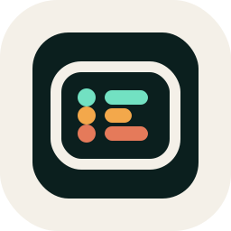
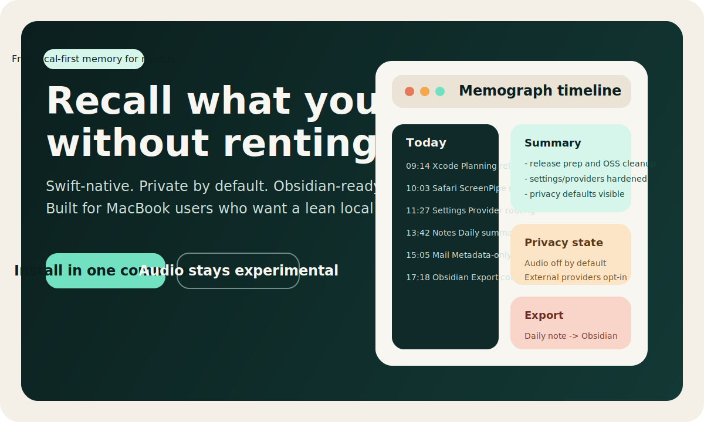
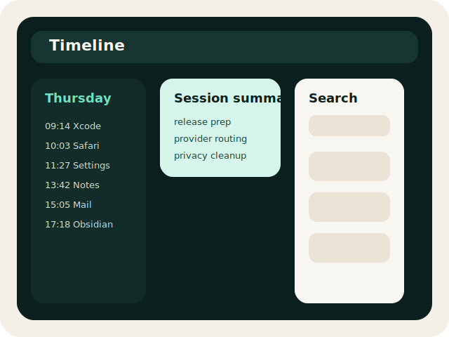
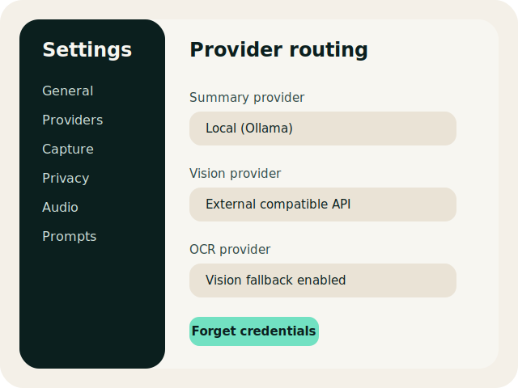
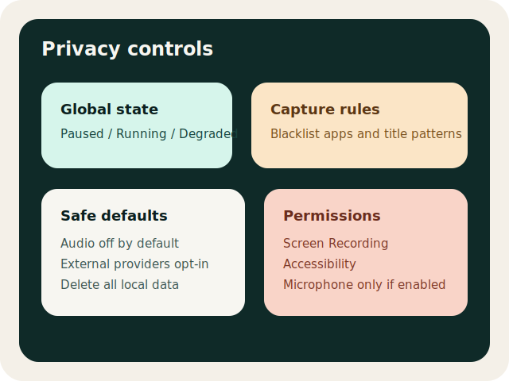

# Memograph

<p align="center">
  
</p>

<p align="center">
  <strong>Free, local-first memory for macOS.</strong><br />
  Search what you saw, capture context privately, and export your day to Obsidian.
</p>

<p align="center">
  
  
  
  
</p>



## Why Memograph

Screen memory tools are getting broader, heavier, and more commercial. Memograph goes in the opposite direction: one Mac, one local database, one focused workflow.

- Free desktop app in this repo, with no paid gate for the core experience
- Native Swift + SwiftUI + SQLite stack for Apple Silicon Macs
- Local-first defaults: network providers are optional, audio is off by default
- Searchable timeline, daily summaries, and Obsidian export in one app
- Privacy controls that are visible from day one: pause, blacklists, metadata-only mode, delete-all-data

## Why someone picks this over ScreenPipe

Memograph is not trying to be a cross-platform agent platform. It is the focused MacBook build for people who want a leaner, free, macOS-native memory tool.

| Dimension | Memograph | ScreenPipe |
| --- | --- | --- |
| Desktop app access | Free in this repo | Paid prebuilt desktop app on the official site |
| Product focus | macOS-first, Apple Silicon, local workflow | Cross-platform platform and agent ecosystem |
| Stack | Swift, SwiftUI, SQLite | Multi-language cross-platform stack |
| Defaults | Audio off, external providers optional, privacy controls surfaced in Settings | Local-first, but official product also sells paid desktop and Pro layers |
| Best fit | MacBook users who want a simpler local setup | Users who want wider platform coverage and a larger ecosystem |

If you want a free, opinionated, native macOS alternative, that is the lane Memograph is built for.

## Install With Homebrew

```bash
brew tap MartinCampbell1/memograph
brew install --cask memograph
```

## Install In One Command

This is the fastest way to get a local build into `/Applications` right now:

```bash
curl -fsSL https://raw.githubusercontent.com/MartinCampbell1/Memograph/master/scripts/install.sh | bash
```

After install:

```bash
open /Applications/Memograph.app
```

## Build From Source

```bash
git clone https://github.com/MartinCampbell1/Memograph.git
cd Memograph
make run
```

Optional setup for experimental audio and local OCR helpers:

```bash
make setup
```

## Use It Right Now

1. Open the menu bar app.
2. Open `Settings`.
3. Grant Screen Recording and Accessibility if you want full capture.
4. Keep `Audio` disabled unless you explicitly want experimental transcription.
5. Open `Timeline` from the menu bar and let it start collecting context.

Current storage location:

```text
~/Library/Application Support/MyMacAgent
```

## What It Does

- Tracks active apps and windows in a local SQLite database
- Captures screenshots adaptively when readability drops
- Extracts text via Accessibility, Vision OCR, or Ollama-based OCR
- Builds a daily timeline and search index
- Generates summaries locally or through an external provider
- Exports daily notes to Obsidian
- Supports provider routing for OCR, vision, and summaries independently

## Product Modes

- `Local only`: no network providers, summaries local or disabled
- `Hybrid`: capture stays local, summaries can use an external provider
- `Cloud-assisted`: external providers allowed for summaries and screenshot analysis

## Preview

<p align="center">
  
  
  
</p>

## Privacy Model

- Data stays on your Mac by default
- External model providers are opt-in
- Audio transcription is experimental and disabled by default
- Screen capture, Accessibility, and microphone access are optional
- You can blacklist apps, blacklist title patterns, or mark apps as metadata-only
- You can open the app data folder or delete all local data from Settings

More detail: [privacy-model.md](docs/privacy-model.md)

## Permissions

- Screen Recording: screenshot capture and screenshot-based OCR
- Accessibility: app/window titles, focused UI context, selected text
- Microphone: optional, only when experimental audio transcription is enabled

Permission degradation is explicit in the UI. If Screen Recording or Accessibility is denied, Memograph stays usable in reduced mode instead of failing.

More detail: [permissions.md](docs/permissions.md)

## Current Status

- Public source repo: ready
- Local install flow: ready
- Public preview binaries: almost ready
- Signed and notarized release channel: next

## Build And Release

- CI runs `swift build` and `swift test` on every push and pull request
- Release helper scripts live in `scripts/`
- Draft release workflow lives in `.github/workflows/release.yml`
- Homebrew tap is available for preview installs

More detail: [release-process.md](docs/release-process.md)

## Architecture

See [architecture.md](docs/architecture.md).

## Security

See [SECURITY.md](SECURITY.md).

## Contributing

See [CONTRIBUTING.md](CONTRIBUTING.md).

## License

Apache-2.0. See [LICENSE](LICENSE).
